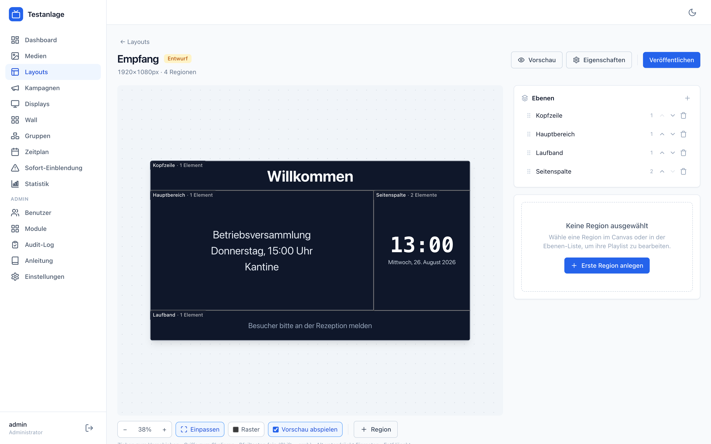
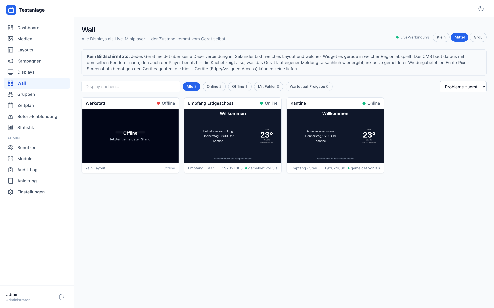
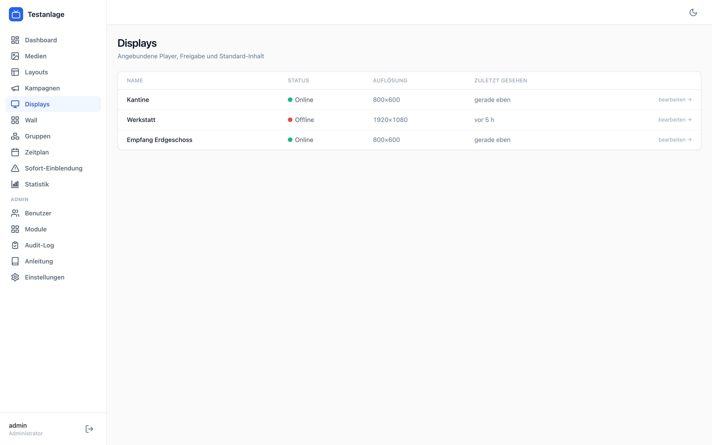
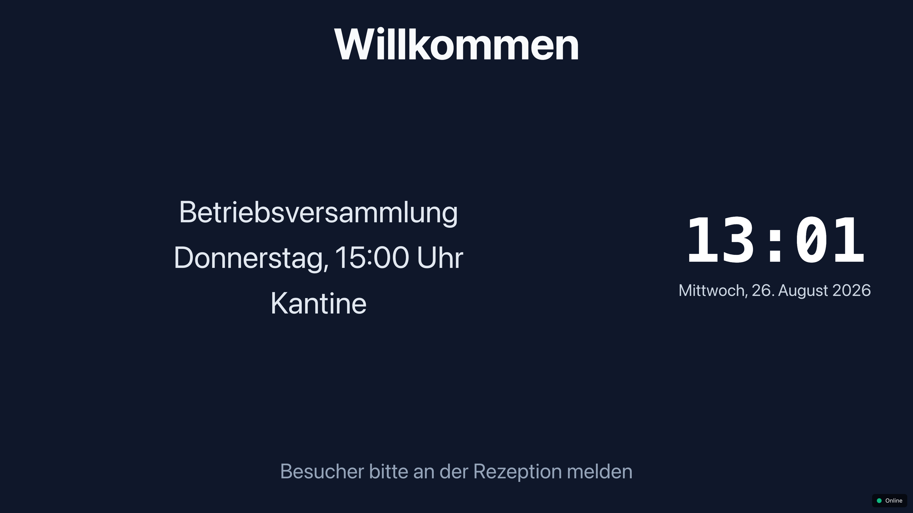
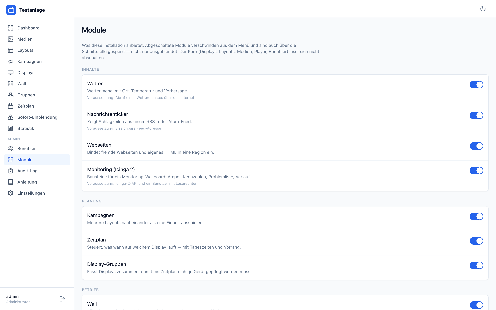
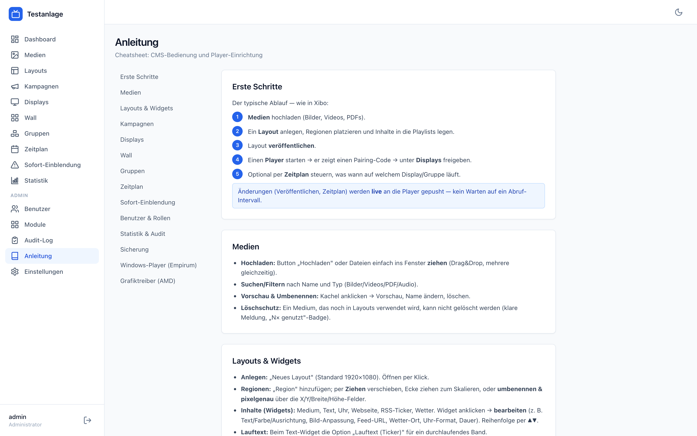

**Digital Signage, das in ~1 Sekunde umschaltet — statt zu pollen.**
*Digital signage that updates in ~1 second — instead of polling.*

[](https://marvinhenrich.github.io/OpenSignage/)
[](LICENSE)


Ein selbst betriebenes Content-Management-System für Bildschirme: Layouts mit Regionen,
Playlists, Kampagnen, Zeitpläne, Displayverwaltung — und Player, die über eine dauerhafte
WebSocket-Verbindung hängen. Eine Änderung im CMS ist auf dem Fernseher, bevor man vom
Schreibtisch aufgestanden ist.

*A self-hosted content management system for screens: layouts with regions, playlists,
campaigns, schedules, display management — and players connected over a persistent
WebSocket. A change in the CMS reaches the screen before you get up from your desk.*

---

## Schnellstart / Quick start

```bash
git clone https://github.com/marvinhenrich/OpenSignage.git
cd opensignage
docker compose up -d
```

Fertig. `https://<Serveradresse>` aufrufen und anmelden.
*That's it. Open `https://<server-address>` and sign in.*



<p align="center"><i>Layout-Editor: Regionen frei ziehen, Vorschau läuft mit.<br>
Layout editor with live preview.</i></p>

Beim ersten Start passiert automatisch:
*On first start, the stack automatically:*

| | |
|---|---|
| 🔑 | Erzeugt eigene Zufallsgeheimnisse für diese Installation — **kein ausgeliefertes Standardkennwort**. *Generates random secrets unique to this installation — no shipped default password.* |
| 🔒 | Erzeugt ein selbstsigniertes TLS-Zertifikat, falls keines hinterlegt ist. *Generates a self-signed TLS certificate if none is present.* |
| 🗄️ | Legt das Datenbankschema an und wandert bei Updates automatisch mit. *Creates the database schema and migrates it on updates.* |

Die Zugangsdaten des ersten Administrators stehen im Protokoll:
*The first administrator's credentials are printed to the log:*

```bash
docker compose logs cms | grep -A3 "ADMIN-BENUTZER"
```

Eigene Einstellungen (Adresse, Active Directory, Icinga) sind **optional** — siehe
[`.env.example`](.env.example). *Custom settings are optional — see [`.env.example`](.env.example).*

---

## Was es kann / What it does

### Live statt Polling / Live instead of polling
Player halten eine WebSocket-Verbindung. Eine Änderung im CMS löst einen gezielten Push an
genau die betroffenen Displays aus — nachladen und Wechsel ohne schwarzes Bild. Fällt das
Netz aus, läuft der zuletzt gültige Stand aus dem lokalen Zwischenspeicher weiter und
gleicht sich beim Wiederverbinden ab.

*Players hold a WebSocket connection. A change in the CMS pushes to exactly the affected
displays — reload and switch without a black frame. If the network drops, the last valid
state keeps playing from the local cache and re-syncs on reconnect.*

### Layout-Editor
Regionen frei ziehen, ausrichten, an anderen Regionen einrasten, gruppiert verschieben,
Größe des Layouts ändern (Regionen skalieren proportional mit). Mit Rückgängig/Wiederholen,
Tastaturbedienung und Vorschau im Zielformat.

*Drag regions freely, align them, snap to other regions, move them as a group, resize the
layout (regions scale proportionally). With undo/redo, keyboard control and a preview in the
target aspect ratio.*

### Wall — alle Displays auf einen Blick / all displays at a glance
Jedes Gerät meldet über seine bestehende Verbindung seinen *tatsächlichen* Ausgabezustand:
Modus, Inhaltsversion, laufendes Widget je Region, Wiedergabefehler. Daraus rendert die Wall
mit **demselben Renderer wie der Player** einen maßstabsgetreuen Mini-Player.

**Ehrlich beschriftet:** Das ist *kein* Bildschirmfoto. Kiosk-Geräte haben keine
Betriebssystem-Brücke, also keine Pixel-Screenshots. Die Oberfläche schreibt „gemeldet vor
X s" bzw. „offline seit …" und behauptet nie, ein Foto zu zeigen.

*Every device reports its actual output state over its existing connection. The wall renders
a true-to-scale mini player from it, using the same renderer as the player. Honestly
labelled: this is not a screenshot — kiosk devices have no OS bridge.*



### Monitoring-Kachel (Icinga 2) / monitoring widget
Zehn Bausteine (Gesamtübersicht, Ampel, Kennzahl, Dienste, Hosts, Problemliste, Gruppen,
zuletzt erholt, Verlauf, Eigenzustand), aus denen man sich eine Monitoring-Wand baut. Auf
Ablesbarkeit aus 3–5 m ausgelegt: Kontraste **gerechnet** statt geraten (jede Statusfarbe
wird so weit auf- oder abgedunkelt, bis sie 4,5:1 nach WCAG erreicht), jeder Zustand trägt
zusätzlich sein Kurzwort — auch bei Farbfehlsichtigkeit eindeutig.

**Die Displays bekommen dabei keinen Zugang ins Monitoring-Netz.** Der Server holt die Daten,
die Zugangsdaten bleiben ausschließlich beim Server.

*Ten building blocks to assemble a monitoring wall. Designed to be readable from 3–5 m:
contrasts are computed, not guessed (every status colour is lightened or darkened until it
reaches 4.5:1 per WCAG), and every state also carries its short word — unambiguous with
colour vision deficiency. Displays never get access to the monitoring network; the server
fetches the data and keeps the credentials.*

### Windows-Kiosk
Fertiges Paket für Windows (Assigned Access + Edge): Autostart, Anmeldung ohne Handarbeit,
Selbstaktualisierung des Players, Ein-/Ausschaltzeiten und ein kleiner Geräteagent, über den
Neustart und Herunterfahren aus dem CMS tatsächlich funktionieren.

**Jedes Gerät bekommt sein eigenes Zufallskennwort und ein eigenes Geheimnis** — ein Gerät
kann sich nicht als ein anderes ausgeben.

*A ready-made Windows kiosk package (Assigned Access + Edge): autostart, hands-free logon,
player self-update, on/off schedule, and a small device agent that makes reboot and shutdown
from the CMS actually work. Every device gets its own random password and its own secret.*

<p align="center">
  
  
</p>
<p align="center"><i>Displayverwaltung und der Player im Vollbild.<br>
Display management and the player in full screen.</i></p>

### Alles in Modulen / everything is a module
Das nackte System ist bewusst klein: Displays, Layouts, Medien, Player, Benutzer. Alles
darüber hinaus — Kampagnen, Zeitplan, Gruppen, Wall, Sofort-Einblendung, Statistik,
Änderungsprotokoll, Wetter, Nachrichtenticker, Webseiten, Monitoring — ist ein Modul, das ein
Administrator unter **Module** abschaltet. Dann verschwindet es aus dem Menü, aus der Auswahl
der Inhalte **und aus der Schnittstelle**: abgeschaltet heißt gesperrt, nicht nur ausgeblendet.

Standard ist an, damit eine frische Installation ohne jede Einstellung vollständig ist. Module
mit Abhängigkeiten weisen darauf hin, statt still zu versagen.

*The bare system is deliberately small: displays, layouts, media, player, users. Everything
else is a module an administrator can switch off — it then disappears from the menu, from the
content picker **and from the API**: disabled means blocked, not just hidden. Everything is on
by default.*



### Betrieb / operations
Betriebsprotokolle, Verfügbarkeit, Wiedergabenachweis, Fehlerberichte — eingebaut, nicht
nachgelagert. Dazu Sicherung per systemd-Timer und ein Wiederherstellungsskript.

*Operational logs, uptime, proof of play, error reporting — built in, not bolted on. Plus
backups via systemd timer and a restore script.*

### Anleitung im Programm / built-in guide
Jede Installation bringt ihre eigene Anleitung mit (**Anleitung** in der Seitenleiste) — von den
ersten Schritten bis zum Ausrollen der Windows-Geräte, samt der Downloads, die dazugehören.

*Every installation ships its own guide, from first steps to rolling out Windows devices,
including the downloads that belong to it.*



---

## Aufbau / Architecture

```
┌──────────┐   WebSocket (Push, ~1 s)   ┌─────────────┐
│  Player  │◀───────────────────────────│             │
│ (Browser)│───────────────────────────▶│     CMS     │
└──────────┘   REST (Inhalt, Medien)    │ Hono/Drizzle│
                                        │             │
┌──────────┐                            │             │
│  Admin   │◀──────────────────────────▶│             │
│ (React)  │   REST + /ws/wall          └──────┬──────┘
└──────────┘                                   │
                                        ┌──────▼──────┐
                                        │ PostgreSQL  │
                                        └─────────────┘
```

| Ebene / layer | Technik / stack |
|---|---|
| CMS | Node.js, Hono, Drizzle ORM, PostgreSQL, `ws` |
| Oberfläche / UI | React, Vite, Tailwind |
| Player | Browser-Vollbild-Renderer mit Medien-Zwischenspeicher |
| Windows-Client | Assigned Access (Edge-Kiosk) + Geräteagent |
| Betrieb / ops | Docker Compose, nginx/TLS |

---

## Sicherheit / Security

Das Projekt ist für den Betrieb im eigenen Netz gebaut. Bewusste Festlegungen:

* **Geräteidentität:** Jedes Display hat ein Geheimnis; der Server speichert nur dessen
  SHA-256-Abdruck. Beim ersten Kontakt wird es gebunden — danach kann sich kein fremdes
  Gerät als ein bereits bekanntes ausgeben. Für den Austauschfall gibt es ein Zurücksetzen
  (nur Administratoren).
* **Medien-Uploads** werden nach Dateiendung gefiltert und mit `nosniff` plus einer strengen
  Content-Security-Policy ausgeliefert — eine hochgeladene Datei kann kein Skript in der
  CMS-Herkunft ausführen.
* **Kein Standardkennwort** im ausgelieferten Stand. Die Datenbank ist nicht nach außen
  veröffentlicht.
* **Icinga-Zugangsdaten** liegen ausschließlich beim Server, nie auf einem Anzeigegerät.
  Bitte einen API-Benutzer mit **nur Leserechten** anlegen.

*Built for operation inside your own network. Device identity is bound on first contact and
verified by SHA-256 fingerprint; media uploads are extension-filtered and served with
`nosniff` and a strict CSP; there is no default password; the database is not published; and
monitoring credentials never leave the server. Please create a read-only Icinga API user.*

Ein selbstsigniertes Zertifikat ist der Standard, weil solche Anlagen typischerweise im
internen Netz ohne öffentlichen Namen stehen. Wer ein echtes Zertifikat hat, legt
`server.crt`/`server.key` in den `certs`-Datenträger — dann wird nichts erzeugt.

*A self-signed certificate is the default because such installations typically sit on an
internal network without a public name. Drop in your own `server.crt`/`server.key` to use a
real one.*

---

## Sichern / Backup

```bash
docker compose exec db pg_dump -U opensignage opensignage > backup.sql
```

Mitsichern: die Datenträger `media` (hochgeladene Dateien) und **`secrets`** — ohne das
Datenbankkennwort lässt sich eine gesicherte Datenbank nicht mehr öffnen.

*Also back up the `media` and **`secrets`** volumes — without the database password a saved
database cannot be opened again.*

Für den Dauerbetrieb liegen ein Sicherungsskript und ein systemd-Timer unter
[`deploy/`](deploy/) bereit. *A backup script and systemd timer are in [`deploy/`](deploy/).*

---

## Sprache / Language

Die Oberfläche ist derzeit **auf Deutsch**. Eine englische Fassung mit organisationsweiter
Spracheinstellung ist in Arbeit — Dokumentation und Quelltextkommentare hier sind bereits
zweisprachig bzw. auf Englisch nachvollziehbar.

*The interface is currently **in German**. An English version with an organisation-wide
language setting is in progress. Documentation is bilingual.*

---

## Lizenz / License

[PolyForm Noncommercial License 1.0.0](LICENSE) — **keine kommerzielle Nutzung.**

**Erlaubt:** ansehen, lernen, verändern und weitergeben; privat nutzen; Einsatz in Schulen,
Hochschulen, Vereinen, gemeinnützigen Einrichtungen und Behörden.

**Nicht erlaubt:** verkaufen, weiterverkaufen, als bezahlten Dienst anbieten oder in einem
Unternehmen zu gewerblichen Zwecken betreiben.

Wer es gewerblich einsetzen möchte, braucht eine gesonderte Erlaubnis von mir — frag einfach.

*Permitted: study, modify, share, personal use, and use by schools, universities, charities and
government. Not permitted: selling, reselling, offering it as a paid service, or running it for
commercial purposes inside a company. For commercial use, ask me for a separate licence.*

> Diese Lizenz ist bewusst **keine** OSI-Open-Source-Lizenz. Das ist Absicht: Open-Source-Lizenzen
> erlauben den Verkauf ausdrücklich, und genau das soll hier nicht möglich sein.
>
> *This is deliberately not an OSI-approved open source licence — open source licences explicitly
> permit selling, which is exactly what this project does not allow.*
